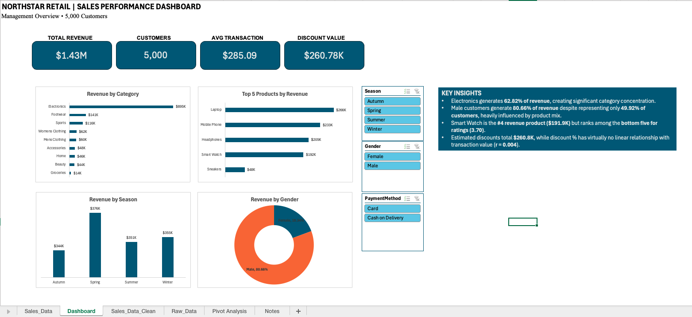

# Northstar Retail Sales Performance Analysis

## Project Overview

This project analyzes retail transaction data for **Northstar Retail
Canada**, a fictional retailer operating in Ontario.

The goal was to take a raw CSV sales export, clean and transform the
data using Power Query, analyze sales and customer behaviour in Excel,
and build an interactive dashboard that management could use to
understand business performance.

The dataset contains **5,000 customer transactions** across multiple
product categories, seasons, payment methods and customer demographics.

## Tools Used

-   Microsoft Excel
-   Power Query
-   PivotTables
-   PivotCharts
-   Excel formulas
-   Slicers
-   Correlation analysis

## Data Preparation

The raw CSV was imported into Excel using **Power Query** to create a
repeatable data-cleaning process.

The transformation process included:

-   Validating column data types
-   Profiling the dataset for errors, null values and inconsistencies
-   Checking Customer IDs for uniqueness
-   Trimming and cleaning text fields
-   Creating customer age groups
-   Calculating estimated original prices before discounts
-   Calculating the estimated dollar value of discounts
-   Loading the cleaned dataset back into Excel for analysis

The resulting workflow is:

**Raw CSV → Power Query → Cleaned Sales Data → PivotTables → Dashboard**

## Dashboard

The interactive Excel dashboard provides management with a high-level
view of retail performance, including:

-   Total Revenue
-   Total Customers
-   Average Transaction Value
-   Estimated Discount Value
-   Revenue by Product Category
-   Top 5 Products by Revenue
-   Revenue by Season
-   Revenue by Gender

Interactive slicers allow the dashboard to be filtered by:

-   Season
-   Gender
-   Payment Method



## Key Findings

### Electronics dominates company revenue

Electronics generated **62.82% of total revenue**, making it by far the
company's largest revenue-generating category.

This also indicates a high level of revenue concentration in one product
category.

### Customer spending differs significantly by gender

Male customers generated **80.66% of total revenue** despite
representing approximately **49.92% of customers**.

Further analysis showed that this difference was heavily influenced by
product mix, particularly Electronics, which was associated exclusively
with male customers in the dataset.

Because of the unusually strong relationship between gender and certain
product categories in the dataset, this pattern should be validated
before being used to make broader assumptions about customer behaviour.

### Smart Watch combines strong revenue with weaker ratings

Smart Watch generated approximately **\$191.9K in revenue**, making it
the **4th highest revenue-generating product**.

However, its average customer rating was approximately **3.70**, placing
it among the five lowest-rated products.

This could warrant further investigation into customer satisfaction,
product quality or customer expectations.

### Discounts show little relationship with transaction value

The estimated value of discounts provided was approximately
**\$260.8K**.

Correlation analysis between discount percentage and transaction value
produced:

**r = 0.004**

This indicates virtually no linear relationship between the size of a
discount and transaction value within this dataset.

This does not establish that discounts are ineffective; additional data
would be required to measure their causal impact on purchasing
behaviour.

### Revenue shows limited seasonality

Revenue was relatively evenly distributed across all four seasons, with
each season contributing approximately **24--26%** of total revenue.

Spring generated the highest revenue, but the difference between the
strongest and weakest seasons was relatively small.

## Additional Analysis

Exploratory analysis also examined:

-   Product and category customer ratings
-   Customer age distribution
-   Revenue by age group
-   Payment method preferences
-   Average transaction value by payment method
-   Previous purchase history vs. transaction value
-   Discount percentage vs. transaction value
-   Product performance within each season

## Workbook Structure

  Worksheet            Purpose
  -------------------- ---------------------------------------------------
  `Sales_Data_Clean`   Cleaned dataset produced through Power Query
  `Pivot Analysis`     PivotTables supporting the analysis and dashboard
  `Dashboard`          Interactive management dashboard
  `Notes`              Supporting project notes

## Refreshing the Data

The repository includes the original CSV file in the `data` folder.

Power Query source paths are stored by Excel and may reference the
original location of the CSV on the project creator's computer.

The workbook can be opened and reviewed without refreshing the data.

To refresh the analysis using a downloaded copy of the repository:

1.  Open `Northstar_Retail_Sales_Analysis.xlsx`.
2.  Open the Power Query Editor.
3.  Select the sales-data query.
4.  Edit the **Source** step.
5.  Point it to `data/store_sales.csv` on your local computer.
6.  Select **Refresh All** in Excel.

The Power Query transformations, cleaned dataset, PivotTables and
dashboard will then refresh using the new source.

## Repository Structure

``` text
retail-sales-performance-analysis/
│
├── README.md
├── Northstar_Retail_Sales_Analysis.xlsx
├── dashboard.png
└── data/
    └── store_sales.csv
```

## Skills Demonstrated

This project demonstrates practical junior data analyst skills in:

-   Data cleaning and validation
-   Power Query
-   Excel formulas
-   PivotTable analysis
-   Data visualization
-   Dashboard development
-   Customer segmentation
-   Descriptive analysis
-   Correlation analysis
-   Business insight generation
-   Translating analytical results into management-focused reporting
